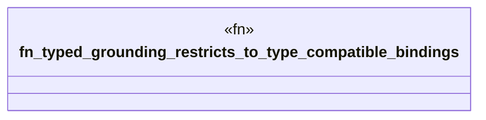

# `crates/bcinr-pddl/tests/typed_grounding.rs`

Source SHA-256: `b4b8bd260926cc65bdb6d9d8914a01ca65c4e43de848937e611bfde3eae7b7d6`

## Dependencies

- `bcinr_pddl::{domain_from_pddl, problem_from_pddl, GroundProblem}`

## Standing

- Structural parse: `ALIVE`
- Runtime behavior: `UNKNOWN`
