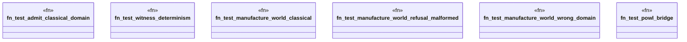

# `crates/bcinr-pddl/tests/vision2030.rs`

Source SHA-256: `0f7a7515f82fbc71ab55ac7d7d1109549e8b8812db28b8f3164d2d7bfc732d6d`

## Dependencies

- `bcinr_pddl::powl_bridge::temporal_plan_to_powl_tape`
- `bcinr_pddl::{admit_candidate_domain, manufacture_world}`

## Standing

- Structural parse: `ALIVE`
- Runtime behavior: `UNKNOWN`
