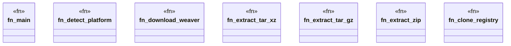

# `crates/chicago-tdd-tools/build.rs`

Source SHA-256: `a5c5ccf2b3fa59d3f016328c634ff657e4b720536e5a02356423a95ecfc18c14`

## Dependencies

- `std::env`
- `std::fs`
- `std::os::unix::fs::PermissionsExt`
- `std::path::{Path, PathBuf}`
- `std::process::Command`

## Standing

- Structural parse: `ALIVE`
- Runtime behavior: `UNKNOWN`
