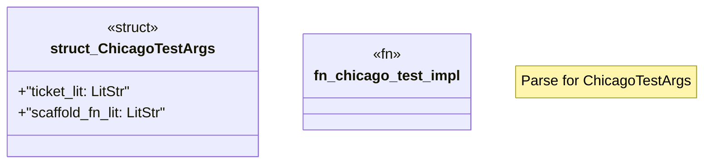

# `crates/chicago-tdd-tools/proc_macros/src/chicago_test.rs`

Source SHA-256: `1267025497c15ad726486f643c0f0216bb2d3bd3f7206daf89995b1a59bed902`

## Dependencies

- `crate::path_resolver::{extract_ticket_id, workspace_root}`
- `proc_macro2::Span`
- `proc_macro::TokenStream`
- `quote::quote`
- `syn::{ parse::{Parse, ParseStream}, Ident, ItemFn, LitStr, Result, Token, }`

## Standing

- Structural parse: `ALIVE`
- Runtime behavior: `UNKNOWN`
