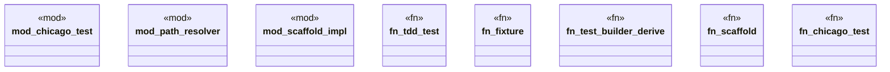

# `crates/chicago-tdd-tools/proc_macros/src/lib.rs`

Source SHA-256: `0be1c027ac167323ae311db9e8ad52bc75fe9c546ef5d3ce41ac4314edf66964`

## Dependencies

- `proc_macro::TokenStream`
- `quote::quote`
- `syn::{parse_macro_input, Data, DeriveInput, Fields, ItemFn}`

## Standing

- Structural parse: `ALIVE`
- Runtime behavior: `UNKNOWN`
