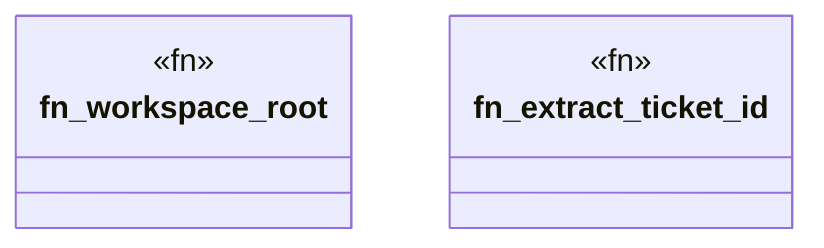

# `crates/chicago-tdd-tools/proc_macros/src/path_resolver.rs`

Source SHA-256: `d87772a7ddd846eae80040dac09a7e188867d78475ab60cc97abc86f2261a03e`

## Dependencies

- `std::path::{Path, PathBuf}`

## Standing

- Structural parse: `ALIVE`
- Runtime behavior: `UNKNOWN`
