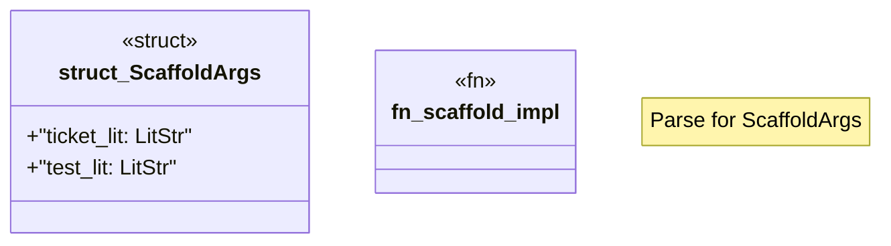

# `crates/chicago-tdd-tools/proc_macros/src/scaffold_impl.rs`

Source SHA-256: `9ded91944bff5bf7b438c086557e2f1f4f4a05695a540e212d917c13c1d8da87`

## Dependencies

- `crate::path_resolver::{extract_ticket_id, workspace_root}`
- `proc_macro2::Span`
- `proc_macro::TokenStream`
- `quote::quote`
- `syn::{ parse::{Parse, ParseStream}, LitStr, Result, Token, }`

## Standing

- Structural parse: `ALIVE`
- Runtime behavior: `UNKNOWN`
