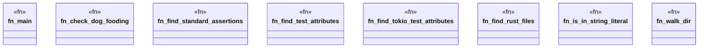

# `crates/chicago-tdd-tools/src/bin/check_dog_fooding.rs`

Source SHA-256: `5d28a9f69dc6d974c3474ac2b6f0d30004fce96f9d9c1711bb10c360d9804e05`

## Dependencies

- `std::fs`
- `std::path::{Path, PathBuf}`

## Standing

- Structural parse: `ALIVE`
- Runtime behavior: `UNKNOWN`
