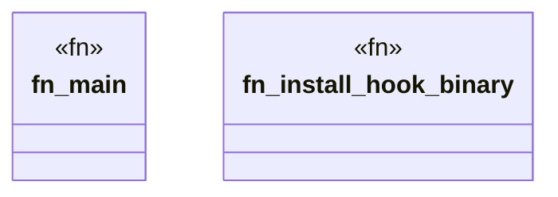

# `crates/chicago-tdd-tools/src/bin/git_hook_installer.rs`

Source SHA-256: `1655b8ddc3ee9adb41ca4a0b2d161dec6ee954967001399367a613bc51d638ea`

## Dependencies

- `git2::Repository`
- `std::fs`
- `std::os::unix::fs::PermissionsExt`
- `std::process::Command`

## Standing

- Structural parse: `ALIVE`
- Runtime behavior: `UNKNOWN`
