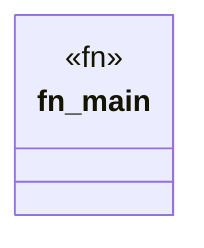

# `crates/chicago-tdd-tools/src/bin/otel_negative_run.rs`

Source SHA-256: `07dd896d22d3bce836ce89b7d27e0d217ebf682954660de692bc887202ef779f`

## Dependencies

- `opentelemetry::KeyValue`
- `opentelemetry::trace::{Span, Tracer, TracerProvider as _}`
- `opentelemetry_otlp::WithExportConfig`
- `opentelemetry_sdk::Resource`
- `opentelemetry_sdk::trace::{RandomIdGenerator, Sampler, SdkTracerProvider}`
- `std::time::Duration`

## Standing

- Structural parse: `ALIVE`
- Runtime behavior: `UNKNOWN`
