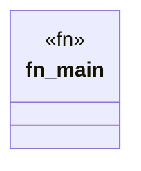

# `crates/chicago-tdd-tools/src/bin/otel_production_run.rs`

Source SHA-256: `088bc2d90fbd77e0132a139e4782d3cdfe0734b50aeb7533c612ccd19d66f99e`

## Dependencies

- `opentelemetry::KeyValue`
- `opentelemetry::trace::{Span, Tracer, TracerProvider as _}`
- `opentelemetry_otlp::WithExportConfig`
- `opentelemetry_sdk::Resource`
- `opentelemetry_sdk::trace::{RandomIdGenerator, Sampler, SdkTracerProvider}`
- `std::time::Duration`

## Standing

- Structural parse: `ALIVE`
- Runtime behavior: `UNKNOWN`
