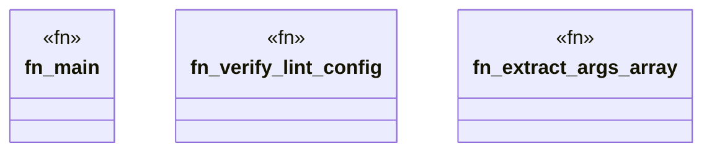

# `crates/chicago-tdd-tools/src/bin/verify_lint_config.rs`

Source SHA-256: `686f8a780d91c2a4f140100376057e1cdb5da7e297ca177795a6f66621591c92`

## Dependencies

- `std::fs`

## Standing

- Structural parse: `ALIVE`
- Runtime behavior: `UNKNOWN`
