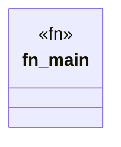

# `crates/chicago-tdd-tools/src/bin/weaver_smoke.rs`

Source SHA-256: `fb2cfc97a25681b55b2b5fc5c72c12b703cf382e4071704d32278a8e58a85664`

## Dependencies

- `chicago_tdd_tools::observability::weaver::types::WeaverLiveCheck`
- `chicago_tdd_tools::observability::weaver::{ send_test_span_to_weaver, WeaverValidationError, WeaverValidator, }`
- `chicago_tdd_tools::observability::weaver::{DEFAULT_OTLP_GRPC_PORT, LOCALHOST}`
- `std::path::PathBuf`
- `std::process::Command`
- `std::thread::sleep`
- `std::time::Duration`

## Standing

- Structural parse: `ALIVE`
- Runtime behavior: `UNKNOWN`
