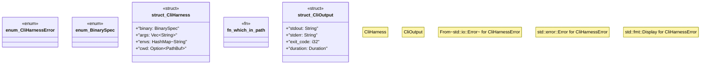

# `crates/chicago-tdd-tools/src/cli_proof/harness.rs`

Source SHA-256: `537917fb9507cadcf32c4b42566b771ef95a78bd8c44dd52ec24a5a28f559e5e`

## Dependencies

- `crate::cli_proof::TempWorkspace`
- `std::collections::HashMap`
- `std::ffi::OsStr`
- `std::path::{Path, PathBuf}`
- `std::process::Command`
- `std::time::{Duration, Instant}`

## Standing

- Structural parse: `ALIVE`
- Runtime behavior: `UNKNOWN`
