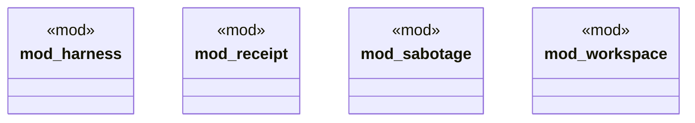

# `crates/chicago-tdd-tools/src/cli_proof/mod.rs`

Source SHA-256: `cf686fea40e84c0100e999681d4a4da4be0188cfaa7857b164dfa5302d9dd53c`

## Dependencies

- `harness::{CliHarness, CliOutput}`
- `receipt::ReceiptAssertions`
- `sabotage::SabotageFixture`
- `workspace::TempWorkspace`

## Standing

- Structural parse: `ALIVE`
- Runtime behavior: `UNKNOWN`
