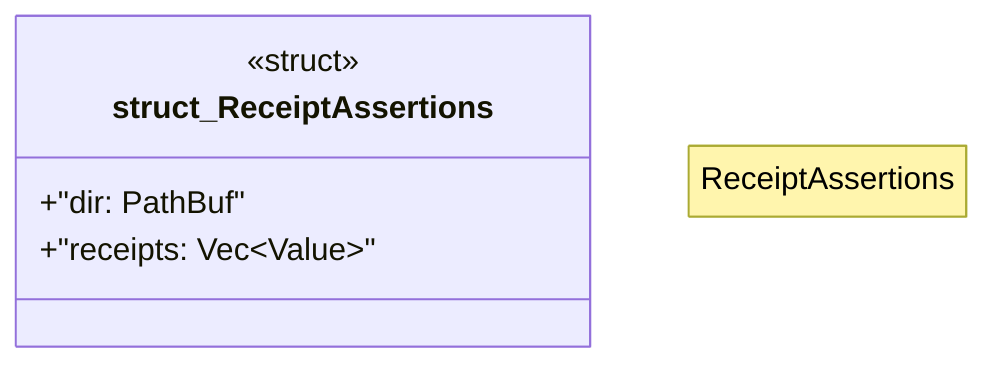

# `crates/chicago-tdd-tools/src/cli_proof/receipt.rs`

Source SHA-256: `366372ad5b35039c372d33c64b36ba9a34413645de68fba74b22ba0cf6324ff7`

## Dependencies

- `serde_json::Value`
- `std::fs`
- `std::path::{Path, PathBuf}`

## Standing

- Structural parse: `ALIVE`
- Runtime behavior: `UNKNOWN`
