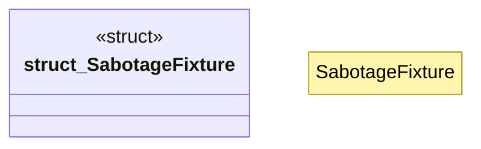

# `crates/chicago-tdd-tools/src/cli_proof/sabotage.rs`

Source SHA-256: `7b2207fb9d234cfe518456d6487ecba8fb8f9002f4e2f2eb2b79755e098314c6`

## Dependencies

- `std::fs`
- `std::path::Path`

## Standing

- Structural parse: `ALIVE`
- Runtime behavior: `UNKNOWN`
