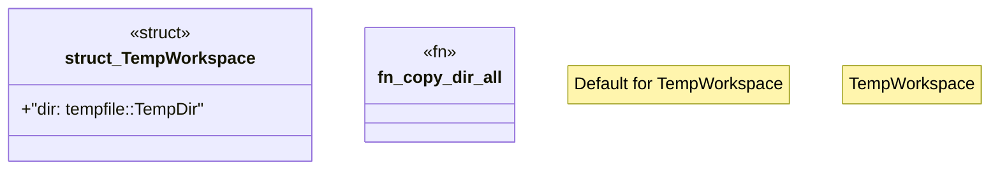

# `crates/chicago-tdd-tools/src/cli_proof/workspace.rs`

Source SHA-256: `6a448e2c7e09a91b80b42558c2159c81b6920be468a4d54f757581ed94f76e88`

## Dependencies

- `std::fs`
- `std::io::Write as _`
- `std::path::{Path, PathBuf}`

## Standing

- Structural parse: `ALIVE`
- Runtime behavior: `UNKNOWN`
