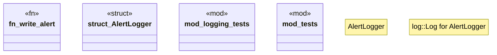

# `crates/chicago-tdd-tools/src/core/alert.rs`

Source SHA-256: `eeb44934890103beca43084bd7871d990f21e4d5f6f87a5537deae30c04d051d`

## Dependencies

- `log::Log`
- `std::io::{self, Write}`
- `super::*`

## Standing

- Structural parse: `ALIVE`
- Runtime behavior: `UNKNOWN`
