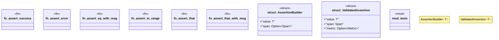

# `crates/chicago-tdd-tools/src/core/assertions.rs`

Source SHA-256: `a17c3bcee94444bea9c7dcad953c4a395624447cd68e78090ddf60b6213fdd61`

## Dependencies

- `crate::observability::otel::types::{ Metric, MetricValue, Span, SpanContext, SpanId, SpanStatus, TraceId, }`
- `crate::test`
- `std::time::{SystemTime, UNIX_EPOCH}`
- `super::*`

## Standing

- Structural parse: `ALIVE`
- Runtime behavior: `UNKNOWN`
