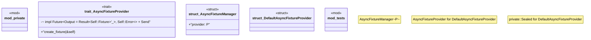

# `crates/chicago-tdd-tools/src/core/async_fixture.rs`

Source SHA-256: `2092cb3ddce44cd7704b6c2bf42b6759ca427249a02d0996482690e879137af9`

## Dependencies

- `crate::assert_eq_msg`
- `crate::assert_err`
- `crate::assert_ok`
- `crate::assertions::assert_that_with_msg`
- `crate::async_test`
- `crate::core::fixture::FixtureError`
- `crate::core::fixture::{FixtureError, FixtureResult}`
- `std::future::Future`
- `super::{AsyncFixtureManager, AsyncFixtureProvider, DefaultAsyncFixtureProvider}`

## Standing

- Structural parse: `ALIVE`
- Runtime behavior: `UNKNOWN`
