# `crates/chicago-tdd-tools/src/core/builders.rs`

Source SHA-256: `1d1d5b229c2cac8e05ce65a7064e4e979a695b0f547308370881f028c9f614ad`

```mermaid
classDiagram
    class fn_generate_trace_id {
      <<fn>>
    }
    class fn_generate_span_id {
      <<fn>>
    }
    class type_PresetFn {
      <<type>>
    }
    class fn_preset_registry {
      <<fn>>
    }
    class type_ValidationFn {
      <<type>>
    }
    class struct_TestDataBuilder {
      <<struct>>
      +"data: HashMap~String"
      +"validations: Vec~ValidationFn~"
    }
    class struct_GenericTestDataBuilder {
      <<struct>>
      +"data: HashMap~String"
      +"_key_type: std::marker::PhantomData~K~"
      +"_value_type: std::marker::PhantomData~V~"
    }
    class struct_ValidatedTestDataBuilder {
      <<struct>>
      +"data: HashMap~String"
      +"_validation: std::marker::PhantomData~T~"
      +"span: Option~Span~"
    }
    class struct_FakeDataGenerator {
      <<struct>>
    }
    class mod_tests {
      <<mod>>
    }
    note "Default for FakeDataGenerator"
    note "Default for GenericTestDataBuilder~K"
    note "Default for TestDataBuilder"
    note "Default for ValidatedTestDataBuilder~T~"
    note "FakeDataGenerator"
    note "GenericTestDataBuilder~K"
    note "TestDataBuilder"
    note "ValidatedTestDataBuilder~T~"
    note "std::fmt::Debug for TestDataBuilder"
```

## Dependencies

- `crate::observability::otel::types::{Span, SpanContext, SpanId, SpanStatus, TraceId}`
- `crate::test`
- `fake::{Fake, Faker}`
- `serde_json::Value`
- `std::collections::HashMap`
- `std::sync::atomic::{AtomicU64, Ordering}`
- `std::sync::{Mutex, OnceLock}`
- `std::time::{SystemTime, UNIX_EPOCH}`
- `super::*`

## Standing

- Structural parse: `ALIVE`
- Runtime behavior: `UNKNOWN`
