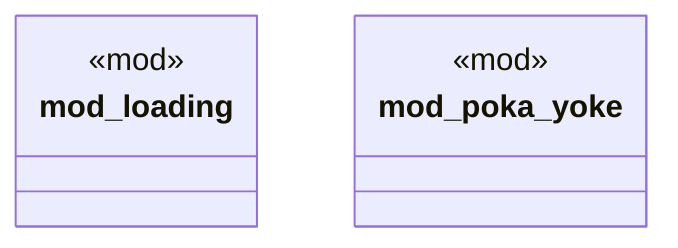

# `crates/chicago-tdd-tools/src/core/config/mod.rs`

Source SHA-256: `c24aa0342e93c4a719aab6dc3a382db476313b8dad6b79c659e8a8aef115ffcf`

## Dependencies

- None observed.

## Standing

- Structural parse: `ALIVE`
- Runtime behavior: `UNKNOWN`
