# `crates/chicago-tdd-tools/src/core/config/poka_yoke.rs`

Source SHA-256: `a40c431efee81731149a74483c9194a6eff7e0a5e69292c8cb0acb58a54ad90a`

```mermaid
classDiagram
    class struct_NonZeroPort {
      <<struct>>
      +"value: std::num::NonZeroU16"
    }
    class struct_PositiveTimeout {
      <<struct>>
      +"value: std::num::NonZeroU64"
    }
    class struct_BoundedTimeout {
      <<struct>>
      +"value: std::num::NonZeroU64"
    }
    class struct_BoundedU32 {
      <<struct>>
      +"value: std::num::NonZeroU32"
    }
    class struct_PositiveU32 {
      <<struct>>
      +"value: std::num::NonZeroU32"
    }
    class struct_PositiveUsize {
      <<struct>>
      +"value: std::num::NonZeroUsize"
    }
    class struct_ValidCoverage {
      <<struct>>
      +"value: f64"
    }
    class struct_ValidCoverageRange {
      <<struct>>
      +"min: ValidCoverage"
      +"max: ValidCoverage"
    }
    class struct_Incomplete {
      <<struct>>
    }
    class struct_Complete {
      <<struct>>
    }
    class struct_ConfigBuilder {
      <<struct>>
      +"unit_timeout: Option~PositiveTimeout~"
      +"integration_timeout: Option~PositiveTimeout~"
      +"otlp_grpc_port: Option~NonZeroPort~"
      +"admin_port: Option~NonZeroPort~"
      +"coverage_range: Option~ValidCoverageRange~"
      +"_state: PhantomData~State~"
    }
    class struct_ValidatedConfig {
      <<struct>>
      +"unit_timeout: PositiveTimeout"
      +"integration_timeout: PositiveTimeout"
      +"otlp_grpc_port: NonZeroPort"
      +"admin_port: NonZeroPort"
      +"coverage_range: ValidCoverageRange"
    }
    class mod_tests {
      <<mod>>
    }
    note "BoundedTimeout"
    note "BoundedU32"
    note "ConfigBuilder~Incomplete~"
    note "Default for ConfigBuilder~Incomplete~"
    note "From~BoundedTimeout~ for u64"
    note "From~BoundedU32~ for u32"
    note "From~NonZeroPort~ for u16"
    note "From~PositiveTimeout~ for u64"
    note "From~PositiveU32~ for u32"
    note "From~PositiveUsize~ for usize"
    note "From~ValidCoverage~ for f64"
    note "NonZeroPort"
    note "PositiveTimeout"
    note "PositiveU32"
    note "PositiveUsize"
    note "ValidCoverage"
    note "ValidCoverageRange"
    note "ValidatedConfig"
```

## Dependencies

- `std::marker::PhantomData`
- `super::*`

## Standing

- Structural parse: `ALIVE`
- Runtime behavior: `UNKNOWN`
