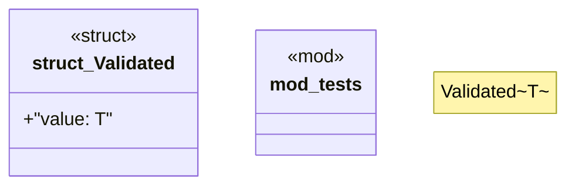

# `crates/chicago-tdd-tools/src/core/const_assert.rs`

Source SHA-256: `d831e627770072b86b4b18ec17a1e0b7a9acf87359793fd274c2a309d052917a`

## Dependencies

- `super::*`

## Standing

- Structural parse: `ALIVE`
- Runtime behavior: `UNKNOWN`
