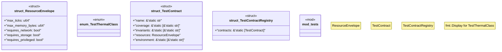

# `crates/chicago-tdd-tools/src/core/contract.rs`

Source SHA-256: `13855be484663e02aeec6fc06667447958a60e192f309590005737b34c959446`

## Dependencies

- `core::fmt`
- `super::*`

## Standing

- Structural parse: `ALIVE`
- Runtime behavior: `UNKNOWN`
