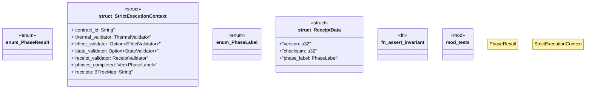

# `crates/chicago-tdd-tools/src/core/fail_fast.rs`

Source SHA-256: `0a46989bec743853eefa37972fe2edec5da71c195fd87ff666b130bff89b3114`

## Dependencies

- `crate::core::invariants::{ ContractValidator, EffectValidator, InvariantResult, ReceiptValidator, StateValidator, ThermalValidator, UnrecoverableInvariantViolation, }`
- `std::collections::BTreeMap`
- `super::*`

## Standing

- Structural parse: `ALIVE`
- Runtime behavior: `UNKNOWN`
