# `crates/chicago-tdd-tools/src/core/fixture.rs`

Source SHA-256: `304a6229b458aacdfeaa8c1d707299ce728f25e286856cb17b241541a0c7b5e4`

```mermaid
classDiagram
    class enum_FixtureError {
      <<enum>>
    }
    class type_FixtureResult {
      <<type>>
    }
    class struct_FixtureMetadata {
      <<struct>>
      +"created_at: u64"
      +"snapshots: Vec~HashMap~String"
    }
    class struct_ScopedMetadata {
      <<struct>>
      +"fixture: &'a mut TestFixture~T~"
      +"key: String"
    }
    class trait_FixtureProvider {
      <<trait>>
      +"create_fixture(&self) -~ Result~Self::Fixture~'_~, Self::Error~"
    }
    class struct_TestFixture {
      <<struct>>
      +"inner: Box~T~"
      +"test_counter: u64"
      +"metadata: HashMap~String"
      +"fixture_metadata: FixtureMetadata"
    }
    class mod_tests {
      <<mod>>
    }
    note "Default for FixtureMetadata"
    note "Default for TestFixture~"
    note "Drop for ScopedMetadata~"
    note "FixtureMetadata"
    note "FixtureProvider"
    note "ScopedMetadata~"
    note "TestFixture~"
    note "TestFixture~T~"
```

## Dependencies

- `crate::test`
- `std::collections::HashMap`
- `std::sync::atomic::{AtomicU64, Ordering}`
- `std::time::{SystemTime, UNIX_EPOCH}`
- `super::*`
- `thiserror::Error`

## Standing

- Structural parse: `ALIVE`
- Runtime behavior: `UNKNOWN`
