# `crates/chicago-tdd-tools/src/core/governance/channel.rs`

Source SHA-256: `7d6baf7ac2ed22c04407176554284ba2f1b0c557725770c5c50e5a245ea1b61e`

```mermaid
classDiagram
    class struct_RunSummary {
      <<struct>>
      +"run_id: RunId"
      +"evaluated: usize"
      +"admitted: usize"
      +"p_admitted: f64"
      +"andon_count: usize"
      +"warning_count: usize"
      +"dominant_category: Option~DiagnosticCategory~"
      +"total_diagnostics: usize"
      +"category_counts: HashMap~DiagnosticCategory"
    }
    class struct_GlobalChannelState {
      <<struct>>
      +"sinks: Vec~Box~dyn DiagnosticSink~~"
      +"queue: Vec~Diagnostic~"
      +"closed: bool"
      +"domain: String"
      +"current_run_id: RunId"
      +"start_time: Instant"
      +"sector_stacks: Vec~Box~dyn SectorStack~~"
      +"merge_strategy: MergeStrategy"
      +"capacity: Option~usize~"
    }
    class fn_get_state {
      <<fn>>
    }
    class fn_register_sink {
      <<fn>>
    }
    class fn_register_domain {
      <<fn>>
    }
    class fn_set_run_id {
      <<fn>>
    }
    class fn_get_domain {
      <<fn>>
    }
    class fn_get_run_id {
      <<fn>>
    }
    class fn_emit_diagnostic {
      <<fn>>
    }
    class fn_register_sector_stack {
      <<fn>>
    }
    class fn_close_channel {
      <<fn>>
    }
    class fn_on_test_started {
      <<fn>>
    }
    class fn_on_test_completed {
      <<fn>>
    }
    class fn_set_channel_capacity {
      <<fn>>
    }
    note "Default for RunSummary"
```

## Dependencies

- `serde::{Deserialize, Serialize}`
- `std::collections::HashMap`
- `std::sync::{Mutex, OnceLock}`
- `std::time::Instant`
- `super::{ Diagnostic, DiagnosticCategory, DiagnosticSink, MergeStrategy, RunId, SectorStack, Severity, }`

## Standing

- Structural parse: `ALIVE`
- Runtime behavior: `UNKNOWN`
