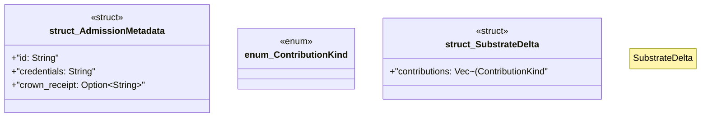

# `crates/chicago-tdd-tools/src/core/governance/laws.rs`

Source SHA-256: `5bcea698e9c71156e303cd27b0dc4e039a5d0d3e0460a9f746905b5866593518`

## Dependencies

- `serde::{Deserialize, Serialize}`

## Standing

- Structural parse: `ALIVE`
- Runtime behavior: `UNKNOWN`
