# `crates/chicago-tdd-tools/src/core/governance/mod.rs`

Source SHA-256: `b080113b6294be1e6022a59d06b8128d56c7409d6caf0565a0e7390c5668fdca`

```mermaid
classDiagram
    class mod_channel {
      <<mod>>
    }
    class mod_laws {
      <<mod>>
    }
    class mod_sector {
      <<mod>>
    }
    class type_RunId {
      <<type>>
    }
    class type_AgentId {
      <<type>>
    }
    class enum_Severity {
      <<enum>>
    }
    class enum_DiagnosticCategory {
      <<enum>>
    }
    class struct_SourceLocation {
      <<struct>>
      +"uri: String"
      +"line: u32"
      +"character: u32"
      +"file: String"
      +"column: u32"
    }
    class struct_DiagnosticCode {
      <<struct>>
      +"domain: String"
      +"category: DiagnosticCategory"
      +"ordinal: u16"
    }
    class struct_Diagnostic {
      <<struct>>
      +"code: DiagnosticCode"
      +"category: DiagnosticCategory"
      +"run_id: RunId"
      +"agent_id: Option~AgentId~"
      +"location: Option~SourceLocation~"
      +"message: String"
      +"severity: Severity"
      +"source_module: &'static str"
      +"context: HashMap~&'static str"
      +"elapsed_ns: u64"
    }
    class trait_DiagnosticSink {
      <<trait>>
      +"emit(&self, diagnostic: Diagnostic) -~ Result~(), String~"
      +"close(&self, summary: RunSummary) -~ Result~(), String~"
    }
    class struct_TaskReceipt {
      <<struct>>
      +"id: String"
      +"timestamp_ms: u64"
      +"payload: String"
      +"signature: Option~String~"
    }
    class fn_sha256_simple {
      <<fn>>
    }
    note "Deserialize~"
    note "Diagnostic"
    note "DiagnosticCategory"
    note "DiagnosticCode"
    note "Display for DiagnosticCategory"
    note "Display for DiagnosticCode"
    note "Display for Severity"
    note "Serialize for DiagnosticCode"
    note "Serialize for SourceLocation"
    note "TaskReceipt"
```

## Dependencies

- `channel::{ close_channel, emit_diagnostic, get_domain, get_run_id, on_test_completed, on_test_started, register_domain, register_sink, set_channel_capacity, set_run_id, RunSummary, }`
- `laws::*`
- `sector::{MergeStrategy, ProcessIntelligenceSector, SectorStack}`
- `serde::ser::SerializeMap`
- `serde::{ de::{self, Deserializer, MapAccess, Visitor}, Deserialize, Serialize, }`
- `std::collections::HashMap`
- `std::fmt::{self, Display}`

## Standing

- Structural parse: `ALIVE`
- Runtime behavior: `UNKNOWN`
