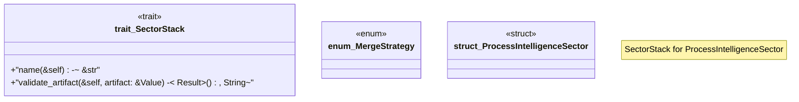

# `crates/chicago-tdd-tools/src/core/governance/sector.rs`

Source SHA-256: `811b4f835d06a1ab1f0e47160186545e5c7e3fb049660b9959267e55aa43b681`

## Dependencies

- `serde_json::Value`

## Standing

- Structural parse: `ALIVE`
- Runtime behavior: `UNKNOWN`
