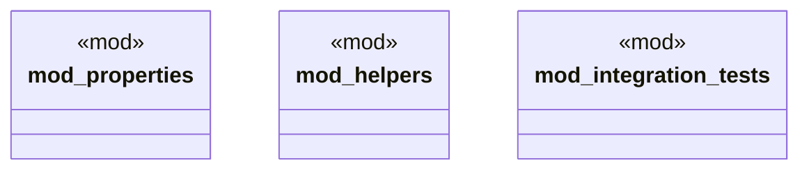

# `crates/chicago-tdd-tools/src/core/invariant_properties.rs`

Source SHA-256: `e9a1661b824cf0aab724c7ede5bf3d8cb8d606e2b836a47c3d753e5427f25d33`

## Dependencies

- `crate::core::fail_fast::*`
- `crate::core::invariant_properties::helpers::*`
- `crate::core::invariants::*`
- `crate::core::invariants::{EffectValidator, InvariantResult, ThermalValidator}`
- `proptest::prelude::*`

## Standing

- Structural parse: `ALIVE`
- Runtime behavior: `UNKNOWN`
