# `crates/chicago-tdd-tools/src/core/invariants.rs`

Source SHA-256: `bc72fdd4de558ff33448bcc6aa4c584f1fff5db7a4a677b5e7a99559a22d5c93`

```mermaid
classDiagram
    class enum_UnrecoverableInvariantViolation {
      <<enum>>
    }
    class type_InvariantResult {
      <<type>>
    }
    class trait_InvariantCheck {
      <<trait>>
      +"check_invariants(&self) -~ InvariantResult~()~"
    }
    class struct_ContractValidator {
      <<struct>>
    }
    class struct_ThermalValidator {
      <<struct>>
      +"last_tau: Option~u64~"
      +"max_jump_threshold: u64"
    }
    class struct_EffectValidator {
      <<struct>>
      +"declared_effects: std::collections::BTreeSet~String~"
    }
    class struct_StateValidator {
      <<struct>>
      +"reachable_states: std::collections::BTreeSet~String~"
      +"current_state: String"
    }
    class struct_ReceiptValidator {
      <<struct>>
      +"expected_version: u32"
    }
    class mod_tests {
      <<mod>>
    }
    note "ContractValidator"
    note "Display for UnrecoverableInvariantViolation"
    note "EffectValidator"
    note "Error for UnrecoverableInvariantViolation"
    note "ReceiptValidator"
    note "StateValidator"
    note "ThermalValidator"
```

## Dependencies

- `std::error::Error`
- `std::fmt::{self, Display}`
- `super::*`

## Standing

- Structural parse: `ALIVE`
- Runtime behavior: `UNKNOWN`
