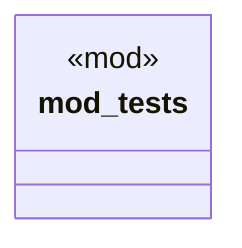

# `crates/chicago-tdd-tools/src/core/macros/assert/collections.rs`

Source SHA-256: `ce0a7f01ce7024054b043bdc1ae609450442990a8106edb942b10236663d91d7`

## Dependencies

- `crate::test`

## Standing

- Structural parse: `ALIVE`
- Runtime behavior: `UNKNOWN`
