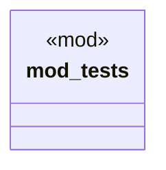

# `crates/chicago-tdd-tools/src/core/macros/assert/equality.rs`

Source SHA-256: `1105a973715ebef0fe02b0128d328406f866ed057174aa56fb30f09f3fe2be34`

## Dependencies

- `crate::test`

## Standing

- Structural parse: `ALIVE`
- Runtime behavior: `UNKNOWN`
