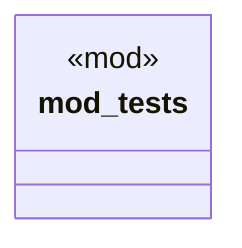

# `crates/chicago-tdd-tools/src/core/macros/assert/json.rs`

Source SHA-256: `8855b31a7a63480a1d4754be0659253948daa4ee3fc0f6342fdec6f21dbf5881`

## Dependencies

- `crate::test`
- `serde_json::json`

## Standing

- Structural parse: `ALIVE`
- Runtime behavior: `UNKNOWN`
