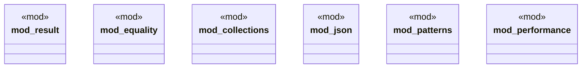

# `crates/chicago-tdd-tools/src/core/macros/assert/mod.rs`

Source SHA-256: `b17588c0e77b132992f774c9dcea809fd1604ff2b4e0bc6a4cf79bd92ac40ce1`

## Dependencies

- None observed.

## Standing

- Structural parse: `ALIVE`
- Runtime behavior: `UNKNOWN`
