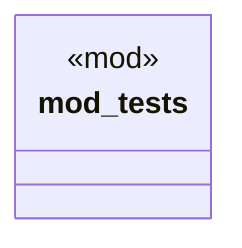

# `crates/chicago-tdd-tools/src/core/macros/assert/patterns.rs`

Source SHA-256: `e3e197000007449282880e33106992ba3bbaf3e7372d1d9cc9ac03b6b853e6eb`

## Dependencies

- `crate::test`

## Standing

- Structural parse: `ALIVE`
- Runtime behavior: `UNKNOWN`
