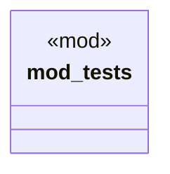

# `crates/chicago-tdd-tools/src/core/macros/assert/performance.rs`

Source SHA-256: `3f52d4d4c39f2480d734424f0188449f68efed10d4c22eacab74368d07cfdf6a`

## Dependencies

- `crate::test`

## Standing

- Structural parse: `ALIVE`
- Runtime behavior: `UNKNOWN`
