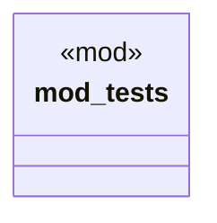

# `crates/chicago-tdd-tools/src/core/macros/assert/result.rs`

Source SHA-256: `c4540c4156d86d09ac271831b79f8a12d1099d892becd49abf2e5b873db806e7`

## Dependencies

- `crate::test`

## Standing

- Structural parse: `ALIVE`
- Runtime behavior: `UNKNOWN`
