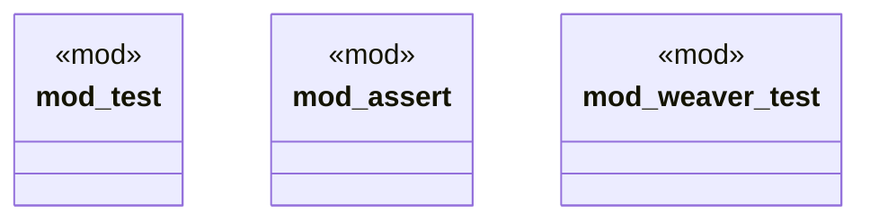

# `crates/chicago-tdd-tools/src/core/macros/mod.rs`

Source SHA-256: `a4b7fa02b74b823b8b0c9a6dabf6154568a4408b130d1912b4719d50d9e80d08`

## Dependencies

- None observed.

## Standing

- Structural parse: `ALIVE`
- Runtime behavior: `UNKNOWN`
