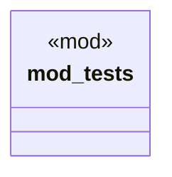

# `crates/chicago-tdd-tools/src/core/macros/test.rs`

Source SHA-256: `e73e4ae595f6550dbf5c6f19fa80fd9d927c3d1063683f863891b5c530c54ebb`

## Dependencies

- `crate::assert_eq_msg`
- `crate::assert_err`
- `crate::assertions::assert_that_with_msg`
- `tokio::time::{timeout, Duration, Instant}`
- `tokio::time::{timeout, Duration}`

## Standing

- Structural parse: `ALIVE`
- Runtime behavior: `UNKNOWN`
