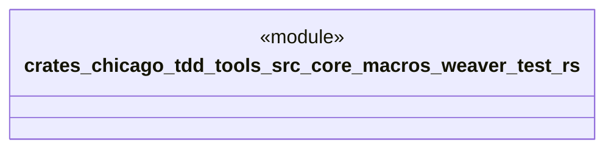

# `crates/chicago-tdd-tools/src/core/macros/weaver_test.rs`

Source SHA-256: `1a1a4b22405bb70e5ef1002064a63c325b5b81033fba72339018ddd963a66190`

## Dependencies

- `$crate::observability::fixtures::WeaverTestFixture`

## Standing

- Structural parse: `ALIVE`
- Runtime behavior: `UNKNOWN`
