# `crates/chicago-tdd-tools/src/core/mod.rs`

Source SHA-256: `8925ae2ff1411c9bafbf3cbfd29bb1dbeb60f7c73c089898f13e0bbc52c51753`

```mermaid
classDiagram
    class mod_alert {
      <<mod>>
    }
    class mod_assertions {
      <<mod>>
    }
    class mod_async_fixture {
      <<mod>>
    }
    class mod_builders {
      <<mod>>
    }
    class mod_config {
      <<mod>>
    }
    class mod_const_assert {
      <<mod>>
    }
    class mod_contract {
      <<mod>>
    }
    class mod_fail_fast {
      <<mod>>
    }
    class mod_fixture {
      <<mod>>
    }
    class mod_governance {
      <<mod>>
    }
    class mod_invariant_properties {
      <<mod>>
    }
    class mod_invariants {
      <<mod>>
    }
    class mod_macros {
      <<mod>>
    }
    class mod_poka_yoke {
      <<mod>>
    }
    class mod_receipt {
      <<mod>>
    }
    class mod_state {
      <<mod>>
    }
    class mod_test_utils {
      <<mod>>
    }
    class mod_type_level {
      <<mod>>
    }
    class mod_verification_pipeline {
      <<mod>>
    }
```

## Dependencies

- `alert::*`
- `assertions::*`
- `async_fixture::*`
- `builders::*`
- `const_assert::*`
- `contract::*`
- `fail_fast::*`
- `fixture::*`
- `governance::*`
- `invariant_properties::helpers`
- `invariants::*`
- `receipt::*`
- `state::*`
- `test_utils::*`
- `type_level::*`
- `verification_pipeline::*`

## Standing

- Structural parse: `ALIVE`
- Runtime behavior: `UNKNOWN`
