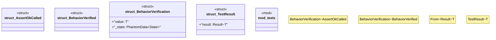

# `crates/chicago-tdd-tools/src/core/poka_yoke.rs`

Source SHA-256: `c0f6626d1675636e5c00704838542e59fcca15a328b3d50861d0d43c27b58a49`

## Dependencies

- `std::marker::PhantomData`
- `super::*`

## Standing

- Structural parse: `ALIVE`
- Runtime behavior: `UNKNOWN`
