# `crates/chicago-tdd-tools/src/core/receipt.rs`

Source SHA-256: `286856703a471b62f947a15932eb736262fa3b1db3d34952e1d7bd828963e871`

```mermaid
classDiagram
    class struct_TestReceipt {
      <<struct>>
      +"receipt_id: String"
      +"contract_name: String"
      +"code_hash: String"
      +"environment: EnvironmentFingerprint"
      +"invariants_checked: Vec~String~"
      +"timing: TimingMeasurement"
      +"effects_exercised: Vec~String~"
      +"result: TestOutcome"
      +"timestamp: u64"
      +"signature: Option~String~"
      +"metadata: Vec~(String"
    }
    class struct_EnvironmentFingerprint {
      <<struct>>
      +"rust_version: String"
      +"os: String"
      +"arch: String"
      +"features: String"
      +"ci_env: Option~String~"
    }
    class struct_TimingMeasurement {
      <<struct>>
      +"total_ticks: u64"
      +"wall_clock_ms: u64"
      +"thermal_class: String"
      +"budget_met: bool"
      +"expected_budget: u64"
    }
    class enum_TestOutcome {
      <<enum>>
    }
    class struct_TestReceiptRegistry {
      <<struct>>
      +"receipts: Vec~TestReceipt~"
    }
    class fn_capture_enabled_features {
      <<fn>>
    }
    class fn_detect_ci_env {
      <<fn>>
    }
    class mod_rustc_version_runtime {
      <<mod>>
    }
    class mod_tests {
      <<mod>>
    }
    note "EnvironmentFingerprint"
    note "TestReceipt"
    note "TestReceiptRegistry"
    note "TimingMeasurement"
    note "std::fmt::Display for TestOutcome"
```

## Dependencies

- `crate::core::contract::TestContract`
- `serde::{Deserialize, Serialize}`
- `sha2::{Digest, Sha256}`
- `std::time::{SystemTime, UNIX_EPOCH}`
- `super::*`

## Standing

- Structural parse: `ALIVE`
- Runtime behavior: `UNKNOWN`
