# `crates/chicago-tdd-tools/src/core/state.rs`

Source SHA-256: `f973ea3ef91d124f2affa04161ee5ed68d17b837e48841a5beda1b3f3a1eca79`

```mermaid
classDiagram
    class mod_private {
      <<mod>>
    }
    class struct_Arrange {
      <<struct>>
    }
    class struct_Act {
      <<struct>>
    }
    class struct_Assert {
      <<struct>>
    }
    class struct_TestState {
      <<struct>>
      +"_phase: std::marker::PhantomData~Phase~"
      +"data: TestData"
    }
    class struct_TestData {
      <<struct>>
      +"arrange_data: Option~Vec~u8~~"
      +"act_result: Option~Vec~u8~~"
    }
    class mod_tests {
      <<mod>>
    }
    note "Default for TestState~Arrange~"
    note "TestState~Act~"
    note "TestState~Arrange~"
    note "TestState~Assert~"
    note "private::Sealed for Act"
    note "private::Sealed for Arrange"
    note "private::Sealed for Assert"
```

## Dependencies

- `super::*`

## Standing

- Structural parse: `ALIVE`
- Runtime behavior: `UNKNOWN`
