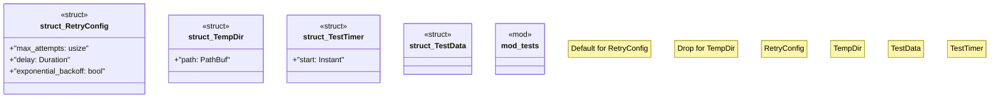

# `crates/chicago-tdd-tools/src/core/test_utils.rs`

Source SHA-256: `e54fd88b3681d86299c5be8a353fd0ab0e145f16a1c3b0cc7c7a2d3ceed2501c`

## Dependencies

- `crate::test`
- `std::path::PathBuf`
- `std::time::{Duration, Instant}`
- `super::*`

## Standing

- Structural parse: `ALIVE`
- Runtime behavior: `UNKNOWN`
