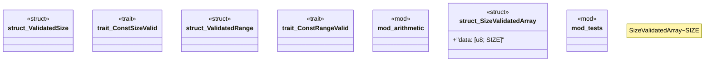

# `crates/chicago-tdd-tools/src/core/type_level.rs`

Source SHA-256: `76f4aa6c35bc36326ae88a5a784bb80703899323e7f565f42b0054341d49a13e`

## Dependencies

- `crate::assert_eq_msg`
- `super::SizeValidatedArray`

## Standing

- Structural parse: `ALIVE`
- Runtime behavior: `UNKNOWN`
